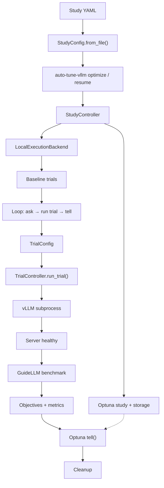
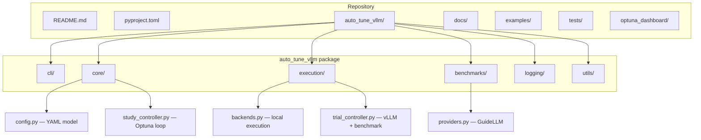
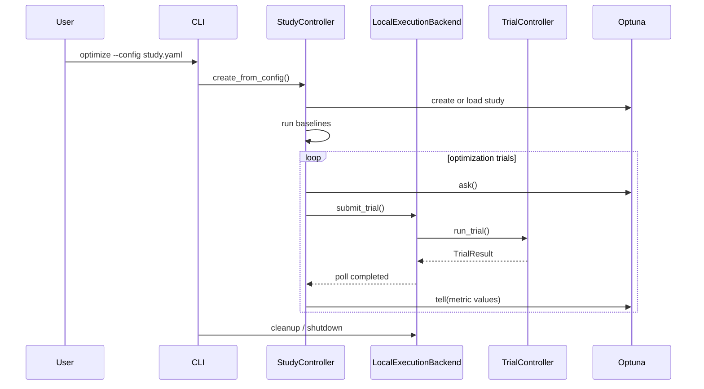
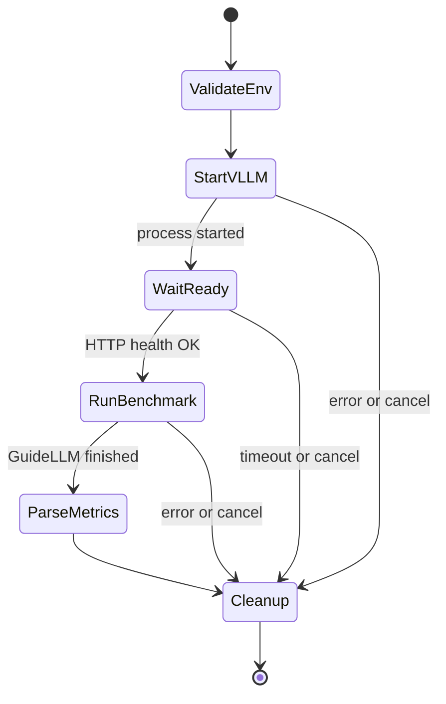
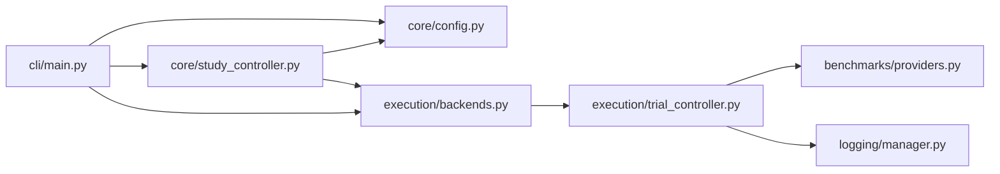
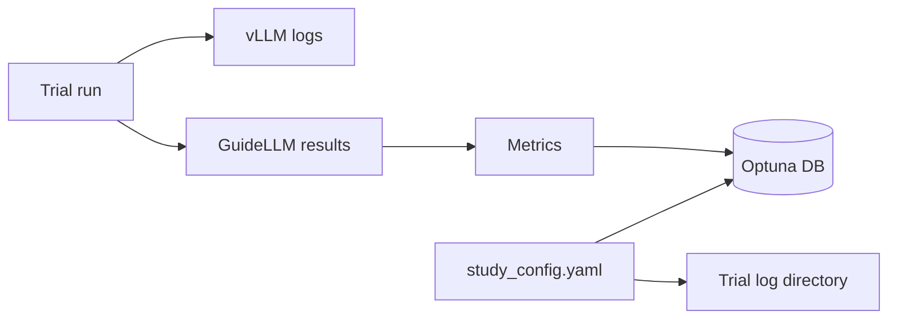

# Architecture overview

How **auto-tune-vllm** fits together: YAML configuration, Optuna studies, local trial execution, vLLM serving, and GuideLLM benchmarks.

The default path uses **`LocalExecutionBackend`** on a single machine. An optional Ray backend exists for legacy distributed setups (see [Ray Cluster Setup](ray_cluster_setup.md)).

---

## End-to-end flow

1. You provide a **study YAML** (see [Configuration Reference](configuration.md)).
2. The CLI loads **`StudyConfig`** and creates a **`StudyController`** with an Optuna study (SQLite or PostgreSQL).
3. Optional **baseline trials** run with default vLLM parameters.
4. The optimizer loops: suggest parameters → run trial → record metrics in Optuna.
5. Each trial starts **vLLM**, waits until healthy, runs **GuideLLM**, then cleans up processes.

---

## Repository layout

| Area | Responsibility |
|------|----------------|
| `cli/` | Commands: `optimize`, `resume`, `logs` |
| `core/` | Config, study orchestration, Optuna storage |
| `execution/` | Backends and per-trial runtime |
| `benchmarks/` | GuideLLM integration |
| `logging/` | Centralized trial logs |
| `examples/` | Study YAMLs, sample datasets, Python demos — see `examples/README.md` |

---

## Study orchestration

Concurrency is controlled by **`--max-concurrent-trials`**: several trials may run in parallel, each with its own vLLM process (subject to GPU memory).

---

## Single trial lifecycle

On failure, error details are stored on the Optuna trial (user attributes) to help the sampler avoid repeating bad configurations.

---

## Module dependencies (simplified)

---

## Outputs per study

Typical locations:

- **Optuna database** — path from `study.storage_file` (SQLite) or `study.database_url` (PostgreSQL).
- **Logs** — `logging.file_path` in your YAML.
- **Dashboard** — `./optuna_dashboard/start_optuna_dashboard.sh path/to/study.db`

---

## Related docs

- [Quick Start](quick_start.md)
- [Configuration Reference](configuration.md)
- [Ray Cluster Setup](ray_cluster_setup.md) (optional, legacy distributed path)
